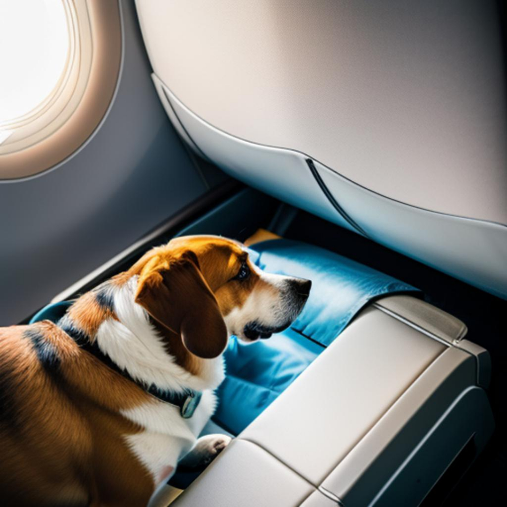

# A viagem do Bart

## 📒 Descrição
Temos a imagem de um cachorro sentando em um banco de avião

## 🤖 Tecnologias Utilizadas
PicsArt

## 🧐 Processo de Criação
Eu utilizei a tecnologia onde eu descrevo uma imagem e a ia me gera uma imagem a partir da descrição.

## 🚀 Resultados

## 💭 Reflexão (Opcional)
Ao mesmo tempo que este desafio demonstra praticidade nestas tarefas, faz levantar o questionamento dos seus limites e suas consequÊncias no mercado de trabalho.
